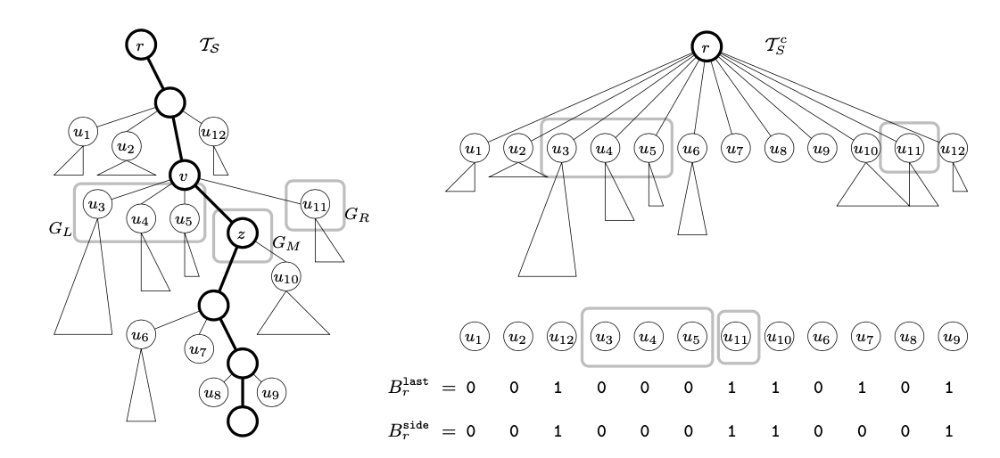

## Overview

常见的字符串索引数据结构存在着空间占用大、缓存命中率低的问题，该论文提出了一种新的字典编码方案，达到接近最优的空间占用以及较好的I/O搜索效率

## 主要工作

- 对 string dictionary problem 的一个解决方案

- 提出了压缩字符串字典的线性化方法，在压缩字符串字典编码的设计上迈出了新的一步，来达到更小的空间占用和I/O搜索效率

- new trie linearization based on the centroid path decomposition（暂译为中心路径分解） of the compacted trie

- 本数据结构对查询的 distribution 敏感

## 主要优点

- trie 的数据结构能够高效地支持 Prefix Range Query

- Cache-Obliviously (缓存无关)，类似 B-tree 这样的结构 Block 大小需要调整来达到最优性能

## FC (Front Coding)

与 SSTable 中 Data Block 的编码方式几乎是一致的。只不过 FC 使用的是两两之间的 longest common prefix ，而与之不同地，RocksDB 的 SSTable 引入重启点的概念，在重启点的位置保存完整的 bitStream 而在其他位置则记录与上一个重启点 bitStream 相同的前缀部分的长度（在 SSTable 中被称为 shared len）

### FC 与 Trie 之间的联系

- 在一个 Compacted Trie 上进行先序遍历所得到的边标签序列就是 FC

- FC 编码与 Trie 的边一一对应

### FC 的缺点

- 解码某个 bit 序列可能需要解压缩整个编码序列，SSTable 的实现中采用的重启点就是为了减小解码整个序列的复杂度，这样解码一个 key 最多只需要在一个重启块中解压缩即可，此方案也即 `locality-preserving front coding (LPFC)`

## RC （Rear Coding）

RC 方式与 FC 的编码方式比较相似，只不过用来表示相邻记录之间的 longest common prefix （简称 lcp）的长度的信息改变为了前者的记录总长减去 lcp 长度。如果顺序访问 RC 编码，可以看做是键盘输入的回退操作

### RC 与 FC 的优劣

虽然 RC 仅仅只在 FC 的基础上进行了非常小的改动，但是有效避免了对最长公共前缀的重复编码

## centroid path decomposition

### 基本概念

- heavy child：

1. 是某个节点 p 的子节点 

2. 这个子节点下的子树在 p 各个子节点下的子树中包含最多叶子节点

- centroid path

1. 从某一节点 u 开始的一条路径

2. 向叶节点方向，每次选择该节点的 heavy child 直到叶子节点的一条路径

- centroid path decomposition

（一开始看到名称的时候，我还以为是 centroid decomposition 点分治技巧，但事实上并不是）centroid path decomposition 事实上包含了缩点的技巧，每一次计算出一条 centroid path 之后将该 path 缩成一个节点，然后递归地在缩成一个点后的子节点上继续进行上述操作

因为每一次寻找 centroid path 都会减少一个叶子节点所以 centroid path decomposition 过程进行 K 次（K 为原始 Trie 的叶子节点个数），这个结论是平凡的

在论文中还给出了一个事实：

`Any root-to-leaf path π in TS (i.e., a string s ∈ S) shares edges with at most ⌈logK⌉ centroid paths.`

等价来讲就是通过 centroid path decomposition 过程得到的树（之后简称为 CPD 树），是一个比较平衡的树，最坏情况下的树高为平衡的二叉树的树高（多数情况下 CPD 树的一个节点下会有多个子节点，这样树高明显小于二叉树树高）

另外，原始树上从 root 到任意节点的 path 与 CPD 也存在着对应关系

### 编码方式

1. 将 CPD 结构进行 DFUDS 编码

2. 在第一步中将每一个缩点后的子树根节点的叶子节点按照 level 优先然后从左至右的方式进行 reshuffle，即图中右侧 CPD 树结构下方的子节点顺序

3. 通过 last、side 以及 head 二进制序列对 level 优先的顺序进行编码（i 表示 level 优先顺序下的需要）

- last[i] = 1 当该子节点位于该层子节点的最右端，否则为0

- side[i] = 1 当子节点位于 πu 路径节点的右边，反之为0

- head[i] = [char] 记录子树到 πu 路径节点的边所表示的字符

